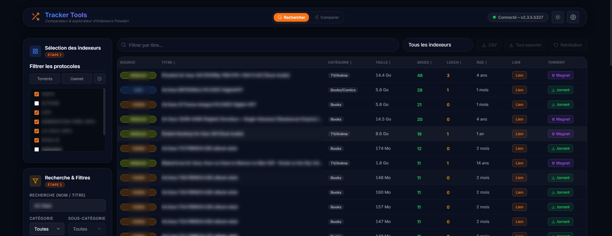
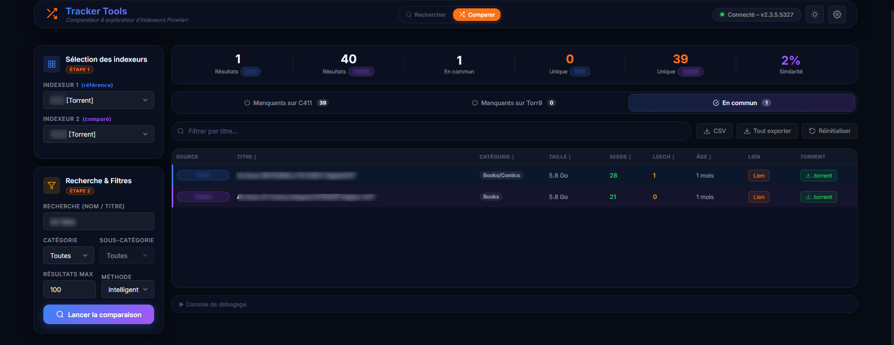

# Tracker Tools

<p align="center">
  
</p>

<p align="center">
  <strong>Tracker Tools</strong> est une interface web pour <a href="https://github.com/Prowlarr/Prowlarr">Prowlarr</a> qui offre deux modes complémentaires : rechercher simultanément sur plusieurs indexeurs, ou comparer deux indexeurs pour identifier les torrents manquants de part et d'autre.
</p>

<p align="center">
  🇬🇧 <a href="README.en.md">English version</a>
</p>

---

## Fonctionnalités

### Mode Recherche
- Recherche multi-indexeurs en parallèle
- Filtre par protocole (Torrents / Usenet)
- Filtrage par catégorie et sous-catégorie
- Tri par colonne (titre, taille, seeds, âge…)
- Filtre par indexeur source sur les résultats
- Export CSV

### Mode Comparaison
- Comparaison de deux indexeurs côte à côte
- Algorithme de matching **intelligent** (similarité Jaccard sur les tokens + proximité de taille) ou **standard** (normalisation de titre)
- Statistiques : résultats par indexeur, torrents communs, manquants, pourcentage de similarité
- Onglets : Manquants sur T1 / Manquants sur T2 / En commun
- Export CSV de chaque onglet ou de tous les onglets

### Général & Utilitaires
- **Favoris (Watchlist)** : sauvegardez d'un clic vos torrents préférés pour les retrouver plus tard, avec filtre et export dédiés (JSON/CSV)
- **Historique complet** : retrouvez toutes vos requêtes précédentes (recherche ou comparaison) et relancez-les en un clic
- Filtre textuel "rapide" sur les résultats de recherche, d'historique et de favoris

### Architecture
- Connexion à Prowlarr via URL + clé API
- Support des indexeurs **Torznab externes** (Jackett, etc.)
- **Persistance totale** assurée par un backend Node.js ultra-léger communiquant avec le volume Docker (URL, clé API, indexeurs manuels, Historique et Favoris)
- Interface "Glassmorphism" au thème clair / sombre
- Bilinguisme natif **FR / EN**
- Pagination fluide des résultats
- Console de débogage intégrée

---

## Captures d'écran

### Mode Recherche


### Mode Comparaison


---

## Déploiement

### 1. Créer le fichier `docker-compose.yml`

```yaml
services:
  tracker-tools:
    image: ghcr.io/mrddream/trackertools:latest
    container_name: TrackerTools
    ports:
      - "8077:80"
    volumes:
      - ./config:/config
    restart: unless-stopped
```

### 2. Lancer

```bash
docker compose up -d
```

L'interface est accessible sur `http://localhost:8077`

### 3. Configuration

Connectez-vous à Prowlarr et ajoutez vos indexeurs directement depuis l'interface via **⚙ Paramètres**. La configuration est automatiquement sauvegardée dans le volume `./config` et restaurée au redémarrage du container.

---

## Configuration CORS Prowlarr

Si Prowlarr tourne sur une machine différente, activez le CORS dans **Prowlarr → Paramètres → Général** :
- **Allowed Hosts** : ajoutez l'IP/domaine où Tracker Tools est hébergé.

---

## Stack technique

- HTML / CSS / JavaScript — aucune dépendance, aucun build
- [Node.js](https://nodejs.org/) pour le serveur de fichiers statiques et la persistance de configuration
- API Prowlarr v1 (`/api/v1/indexer`, `/api/v1/search`)
- API Torznab standard pour les indexeurs manuels

---

## Licence

MIT

---

<p align="center">
  Conçu avec l'aide de <a href="https://www.anthropic.com/claude">Claude</a> &amp; <a href="https://github.com/mrddream">Antigravity</a>
</p>
